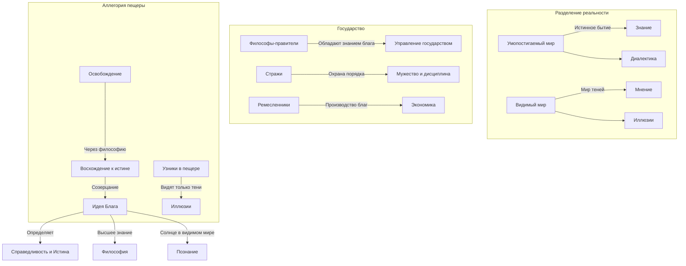

# philosophy

Платон карта понятий из отрывка книги государство

```mermaid
graph TD;
    A["Идея Блага"] -->|Определяет| B["Справедливость и Истина"];
    A -->|Высшее знание| C["Философия"];
    A -->|Солнце в видимом мире| D["Познание"];

    subgraph "Разделение реальности"
        E["Умопостигаемый мир"] -->|Истинное бытие| F["Знание"];
        E --> G["Диалектика"];
        H["Видимый мир"] -->|Мир теней| I["Мнение"];
        H --> J["Иллюзии"];
    end

    subgraph "Государство"
        K["Философы-правители"] -->|Обладают знанием блага| L["Управление государством"];
        M["Стражи"] -->|Охрана порядка| N["Мужество и дисциплина"];
        O["Ремесленники"] -->|Производство благ| P["Экономика"];
    end

    subgraph "Аллегория пещеры"
        Q["Узники в пещере"] -->|Видят только тени| R["Иллюзии"];
        S["Освобождение"] -->|Через философию| T["Восхождение к истине"];
        T -->|Созерцание| A;
    end
```
